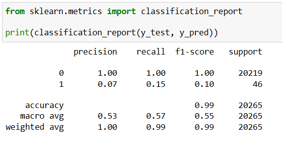
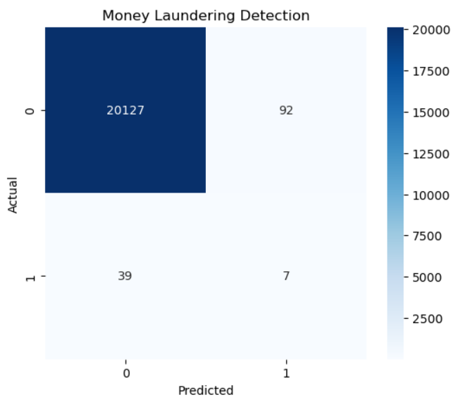
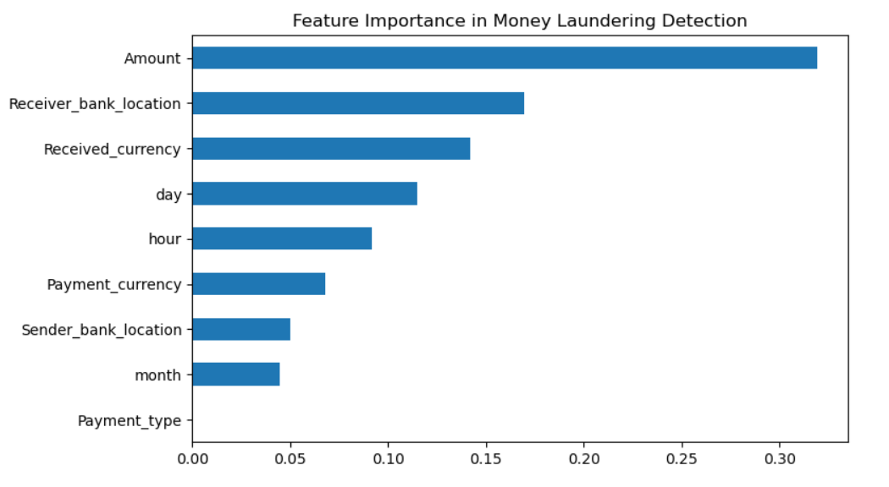
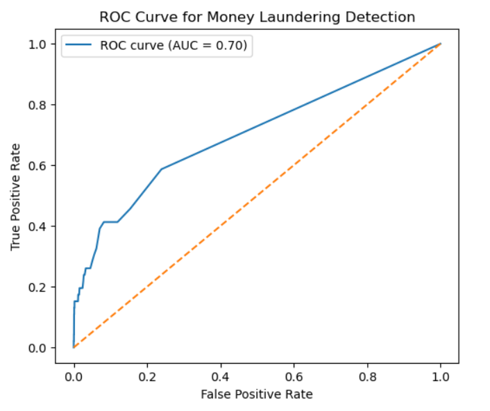

# Financial Fraud Detection using Machine Learning
Machine Learning project for detecting fraudulent financial transactions using classification algorithms.


## Project Overview
This project focuses on detecting fraudulent financial transactions using machine learning classification techniques. The system analyzes transaction data and predicts whether a transaction is legitimate or fraudulent.

The model helps financial institutions identify suspicious transactions and reduce fraud risks.

---

## Technologies Used
- Python
- Pandas
- NumPy
- Scikit-Learn
- Matplotlib
- Seaborn

---

## Dataset
The dataset used for this project contains cross-border financial transaction records.

Location:
dataset/Cross_border.csv

---

## Model Evaluation Results

### Classification Report


### Confusion Matrix


### Feature Importance


### ROC Curve


---

## Project Structure

```
Financial-Fraud-Detection-ML
│
├── dataset
│   └── Cross_border.csv
│
├── notebooks
│   └── Financial_Fraud_Detection.ipynb
│
├── results
│   ├── classification_report.png
│   ├── confusion_matrix.png
│   ├── feature_importance.png
│   └── roc_curve.png
│
└── README.md
```

---

## How to Run the Project

### 1. Clone the Repository
```
git clone https://github.com/Manojrampur8/Financial-Fraud-Detection-ML.git
```

### 2. Navigate to the Project Folder
```
cd Financial-Fraud-Detection-ML
```

### 3. Install Required Libraries
```
pip install pandas numpy scikit-learn matplotlib seaborn
```

### 4. Run the Notebook
```
jupyter notebook notebooks/Financial_Fraud_Detection.ipynb
```

---

## Author

**Manoj S**  
AI & Machine Learning 
Enthusiast
